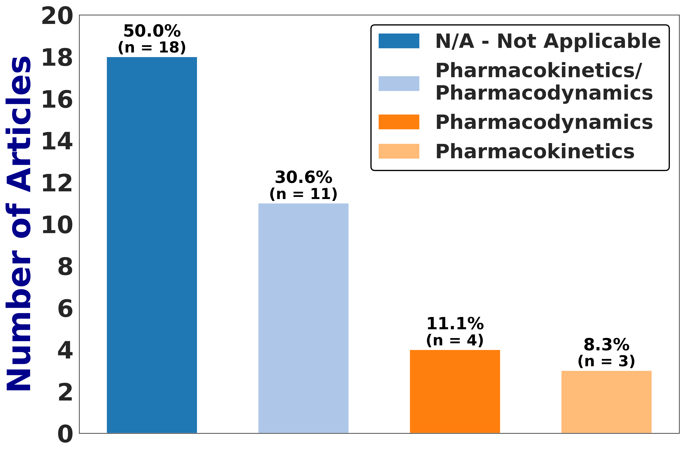
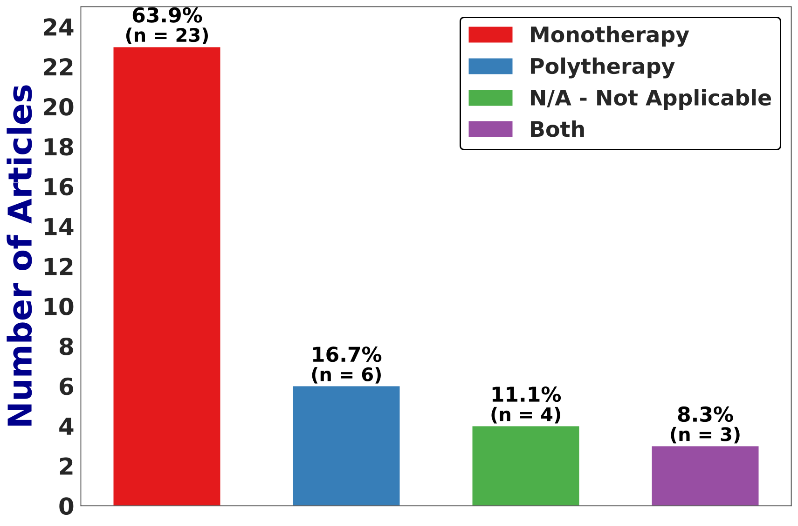

# Mathematical Modeling of AMR – A Scoping Review

This repository contains the **draw data (`all_data`), the cleaned dataset after duplicate removal (`clean_data`), the set of information extracted from the articles (`questionnaire_answers`), Python scripts (`codes`), and the results (`results`)** of a scoping review focused on the **mathematical modelling of AMR**.  

The goal is to map the types of models used in AMR research, the epidemiological contexts investigated, and the main methodological and conceptual gaps that remain in the field.

---

## Key Findings

Our analysis identified major trends and gaps in AMR mathematical modeling. Key results are summarized below:

<table>
<tr>

<!-- 3.1 -->
<td align="center" valign="top" width="33%">
<b>3.1 Type and Context</b> 
Deterministic models dominate, with limited stochastic representation..  
 
<small><b>Model type</b></small>
</td>

<!-- 3.2 -->
<td align="center" valign="top" width="33%">
<b>3.2 Construction and Parameterization</b> 
Limited use of PK/PD models reduces biological realism.  
 
<small><b>PK/PD modelling</b></small>
</td>

<!-- 3.3 -->
<td align="center" valign="top" width="33%">
<b>3.3 Outputs and Validation</b> 
Focus on monotherapy, despite the relevance of combination therapies.  
 
<small><b>Treatment type</b></small>
</td>

</tr>
</table>

---

## About the Data and Scripts

This repository is organized to reproduce all stages of the scoping review analysis — from data collection and cleaning to figure generation.

### 1. Data Sources

- The [`all_data/`](all_data/) folder contains the **raw data** extracted from the three bibliographic databases:
  - **PubMed**
  - **Scopus**
  - **Web of Science**

Each file corresponds to the exported search results **before duplicate removal**.

### 2. Clean Data

- The [`clean_data/`](clean_data/) folder contains the **deduplicated dataset**, generated after running the script [`remove_duplicates.py`](codes/remove_duplicates.py) located in the [`codes/`](codes/) folder.  
- This dataset consolidates all unique records across the three databases and serves as the starting point for descriptive analyses and visualizations.

### 3. Questionnaire Data

- The file [`questionnaire_answers.csv`](questionnaire_answers/questionnaire_answers.csv) contains the **information extracted from each included study**, such as publication year, country, pathogen, model type, and other study-level variables.  
- It must be **downloaded** before running most of the figure scripts, as it provides the main dataset used for Figures **2** and **4–8**.

### 4. Scripts Overview

Each script in the [`codes/`](codes/) folder corresponds to a specific analytical or visualization step:

| Script | Description | Data Source |
|:--------|:-------------|:-------------|
| `remove_duplicates.py` | Removes duplicate articles across PubMed, Scopus, and Web of Science datasets. | `all_data/` |
| `Fig.2.py` | Generates **Figure 2**, showing the **distribution of articles by publication year**. | `questionnaire_answers.csv` |
| `Fig.3.py` | Generates **Figure 3**, showing the **national affiliation of the first author** for all included articles. The **data source is defined directly within the script**. | Defined inside script |
| `Fig.4-Fig.8.py` | Generates **Figures 4–8**, summarizing **modeling characteristics, epidemiological contexts, and research trends** identified in the review. | `questionnaire_answers.csv` |

### 5. Running the Analysis

To reproduce the full workflow from data cleaning to visualization, follow these steps:

1. **Download the raw datasets** from the [`all_data/`](all_data/) folder.  
   These files contain the exported search results from **PubMed**, **Scopus**, and **Web of Science**.

2. **Run the deduplication script** [`remove_duplicates.py`](codes/remove_duplicates.py) to clean the data and generate the unified dataset.  
   The resulting file will be saved in the [`clean_data/`](clean_data/) folder.

3. **Download the extracted study-level dataset** [`questionnaire_answers.csv`](questionnaire_answers/questionnaire_answers.csv) into the [`questionnaire_answers/`](questionnaire_answers/) folder.  
   This file contains all manually extracted information from the included articles and is required for Figures **2** and **4–8**.

4. In the scripts within [`codes/`](codes/), **adjust the file paths** if needed to match your local directory structure.

5. **Run the analysis and visualization scripts sequentially:**
   - `remove_duplicates.py` → Deduplication and generation of `clean_data/`  
   - `Fig.2.py` → Generate **Figure 2** (distribution of articles by publication year; uses `questionnaire_answers.csv`)  
   - `Fig.3.py` → Generate **Figure 3** (national affiliation of first author; data source defined inside the script)  
   - `Fig.4-Fig.8.py` → Generate **Figures 4–8** (model characteristics and trends; use `questionnaire_answers.csv`)

6. **Check the outputs** in the [`results/`](results/) folder, which contains all final tables, figures, and summary visualizations.

